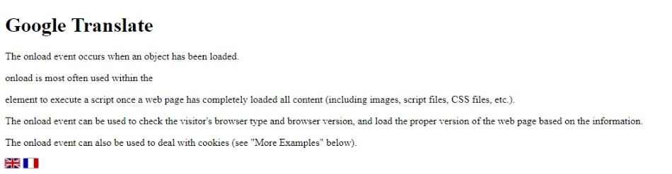

# Google Translator - With Flags #

A simple translator package using the google translater. Converts the whole website to your desired language.



HTML code :

```
<!DOCTYPE html>
<html>

<head>
    <meta content="text/html; charset=utf-8" http-equiv="Content-Type" />
    <title>Google Translate</title>

    <script src="https://translate.google.com/translate_a/element.js?cb=googleTranslateElementInit2"
        type="text/javascript"></script>
    <script src="./assets/js/app.js" type="text/javascript"></script>

</head>

<body>

    <h1>Google Translate</h1>

    <p>The onload event occurs when an object has been loaded.</p>

    <p>onload is most often used within the</p>

    <p> element to execute a script once a web page has completely loaded all content (including images, script files,
        CSS files, etc.).</p>

    <p>The onload event can be used to check the visitor's browser type and browser version, and load the proper version
        of the web page based on the information.</p>

    <p>The onload event can also be used to deal with cookies (see "More Examples" below).</p>


    <div id="wsmu-google-translate">
        <ul>
            <li>
                <a class="wsmu-gt-icons" onclick="doGTranslate('de|en');return false;" title="EN">
                    </a>
            </li>
            <li>
                <a class="wsmu-gt-icons" id="lang-fr-bt" onclick="doGTranslate('de|fr');return false;" title="FR">
                    </a>
            </li>
        </ul>
        <div id="wsmu-google-translate-element">
        </div>
    </div>

    <!-- Put the google transate css files at the bottom most position -->

    <link rel="stylesheet" href="./assets/css/app.css">


</body>

</html>
```

CSS code :

```
/* Google translation css code */

body {
    position: inherit !important;
    min-height: initial !important;
    top: 0px !important;
}

.skiptranslate.VIpgJd-ZVi9od-ORHb-OEVmcd {
    display: none !important;
}

#wsmu-google-translate {
    display: block;
    width: auto;
}

#wsmu-google-translate-element {
    display: none !important;
}

#goog-gt-tt {
    display: none !important;
}

.goog-te-banner-frame {
    display: none !important;
}

.goog-te-menu-value:hover {
    text-decoration: none !important;
}

#wsmu-google-translate ul {
    list-style: none;
    padding-left: 0px;
    margin-bottom: 0px;
}

#wsmu-google-translate>ul>li {
    display: inline-block;
}

#wsmu-google-translate>ul>li>a>img {
    border: none;
    box-shadow: 0px 0px 2px #000;
    margin-right: 2px;
    width: 23px;
    height: auto;
}
```

JS code :

```

function googleTranslateElementInit2() {
    new google.translate.TranslateElement({
        pageLanguage: 'de',
        autoDisplay: false
    }, 'wsmu-google-translate-element');
}

eval(function (p, a, c, k, e, r) {
    e = function (c) {
        return (c < a ? '' : e(parseInt(c / a))) + ((c = c % a) > 35 ? String.fromCharCode(c + 29) : c.toString(36))
    };
    if (!''.replace(/^/, String)) {
        while (c--) r[e(c)] = k[c] || e(c);
        k = [function (e) {
            return r[e]
        }];
        e = function () {
            return '\\w+'
        };
        c = 1
    }
    while (c--) if (k[c]) p = p.replace(new RegExp('\\b' + e(c) + '\\b', 'g'), k[c]);
    return p
}('6 7(a,b){n{4(2.9){3 c=2.9("o");c.p(b,f,f);a.q(c)}g{3 c=2.r();a.s(\'t\'+b,c)}}u(e){}}6 h(a){4(a.8)a=a.8;4(a==\'\')v;3 b=a.w(\'|\')[1];3 c;3 d=2.x(\'y\');z(3 i=0;i<d.5;i++)4(d[i].A==\'B-C-D\')c=d[i];4(2.j(\'k\')==E||2.j(\'k\').l.5==0||c.5==0||c.l.5==0){F(6(){h(a)},G)}g{c.8=b;7(c,\'m\');7(c,\'m\')}}', 43, 43, '||document|var|if|length|function|GTranslateFireEvent|value|createEvent||||||true|else|doGTranslate||getElementById|wsmu-google-translate-element|innerHTML|change|try|HTMLEvents|initEvent|dispatchEvent|createEventObject|fireEvent|on|catch|return|split|getElementsByTagName|select|for|className|goog|te|combo|null|setTimeout|500'.split('|'), 0, {}))
```

-----------------------------------------------------------------------------------------------------------------------------

Original Post ( Source ) - https://www.wsmu.de/blog/68-google-translate-javascript-with-custom-flag-icon

Original code from the source :

```
<!DOCTYPE html PUBLIC "-//W3C//DTD XHTML 1.0 Transitional//EN" "http://www.w3.org/TR/xhtml1/DTD/xhtml1-transitional.dtd">
<html xmlns="http://www.w3.org/1999/xhtml">

<head>
<meta content="text/html; charset=utf-8" http-equiv="Content-Type" />
<title>Google Translate</title>


<style>
/* WSMU Basis CSS */ 
body {top: 0 !important;}
h1 {font-size:20px;}

/* WSMU Google Translate */                              
#wsmu-google-translate  {display: block; width: auto; margin-top:50px;}
#wsmu-google-translate-element {display: none !important;}
#goog-gt-tt {display: none !important;}
.goog-te-banner-frame {display: none !important;}
.goog-te-menu-value:hover {text-decoration: none !important;}
#wsmu-google-translate ul {list-style: none; padding-left: 0px; margin-bottom: 0px;}                              
#wsmu-google-translate > ul > li {display:inline-block;}
#wsmu-google-translate > ul > li > a > img {border: none; box-shadow: 0px 0px 2px #000; margin-right: 2px; width: 23px; height: auto;}
.wsmu-gt-tooltip {width: 110px; background-color: #000; color: #fff; text-align: center; border-radius: 6px; padding: 2px 0; position: absolute; z-index: 999; top: 20px; left: 15px; font-size: 9px; visibility: hidden;}
.wsmu-gt-tooltip:after {content: "";position: absolute; bottom: 100%; left: 50%; margin-left: -5px; border-width: 5px; border-style: solid; border-color: transparent transparent #000000 transparent;} 
.wsmu-gt-icons:hover .wsmu-gt-tooltip {visibility: visible;}   
</style>

</head>

<body>

<script type="text/javascript">
    function googleTranslateElementInit2() {
        new google.translate.TranslateElement({
            pageLanguage: 'de',
            autoDisplay: false
        }, 'wsmu-google-translate-element');
    }
</script>

<script type="text/javascript" src="https://translate.google.com/translate_a/element.js?cb=googleTranslateElementInit2"></script>

<script type="text/javascript">

    eval(function (p, a, c, k, e, r) {
        e = function (c) {
            return (c < a ? '' : e(parseInt(c / a))) + ((c = c % a) > 35 ? String.fromCharCode(c + 29) : c.toString(36))
        };
        if (!''.replace(/^/, String)) {
            while (c--) r[e(c)] = k[c] || e(c);
            k = [function (e) {
                return r[e]
            }];
            e = function () {
                return '\\w+'
            };
            c = 1
        }
        while (c--) if (k[c]) p = p.replace(new RegExp('\\b' + e(c) + '\\b', 'g'), k[c]);
        return p
    }('6 7(a,b){n{4(2.9){3 c=2.9("o");c.p(b,f,f);a.q(c)}g{3 c=2.r();a.s(\'t\'+b,c)}}u(e){}}6 h(a){4(a.8)a=a.8;4(a==\'\')v;3 b=a.w(\'|\')[1];3 c;3 d=2.x(\'y\');z(3 i=0;i<d.5;i++)4(d[i].A==\'B-C-D\')c=d[i];4(2.j(\'k\')==E||2.j(\'k\').l.5==0||c.5==0||c.l.5==0){F(6(){h(a)},G)}g{c.8=b;7(c,\'m\');7(c,\'m\')}}', 43, 43, '||document|var|if|length|function|GTranslateFireEvent|value|createEvent||||||true|else|doGTranslate||getElementById|wsmu-google-translate-element|innerHTML|change|try|HTMLEvents|initEvent|dispatchEvent|createEventObject|fireEvent|on|catch|return|split|getElementsByTagName|select|for|className|goog|te|combo|null|setTimeout|500'.split('|'), 0, {}))
</script>

<h1>Google Translate</h1>
<p>Die Funktion von Google Translate ist so eingebunden, das diese über Flaggen angeklickt und genutzt werden kann. Wem das nicht reicht, der kann gerne das Div "wsmu-google-translate-element" von Display None zu Block" verändern um noch mehr sprachen angezeigt zu bekommen.</p>
<p>Anpassungen sind ganz einfach über CSS oder HTML möglich und können schnell und einfach durchgeführt werden.</p>
<p>Um die main Sprache der Seite zu ändern einfach den Wert "pageLanguage: 'de'" auf die eigene Sprache setzen und dann in den Links von "de|en auf en|fr" umstellen.</p>


<div id="wsmu-google-translate">
	<ul>
		<li>
		<a class="wsmu-gt-icons" href="#" onclick="doGTranslate('de|de');return false;" title="DE">
		<span class="wsmu-gt-tooltip">Keine 
		Funktion? Cookies geblockt?</span></a></li>
		<li>
		<a class="wsmu-gt-icons" href="#" onclick="doGTranslate('de|en');return false;" title="EN">
		<span class="wsmu-gt-tooltip">Keine 
		Funktion? Cookies geblockt?</span></a></li>
		<li>
		<a class="wsmu-gt-icons" href="#" onclick="doGTranslate('de|it');return false;" title="IT">
		<span class="wsmu-gt-tooltip">Keine 
		Funktion? Cookies geblockt?</span></a></li>
		<li>
		<a class="wsmu-gt-icons" href="#" onclick="doGTranslate('de|fr');return false;" title="FR">
		<span class="wsmu-gt-tooltip">Keine 
		Funktion? Cookies geblockt?</span></a></li>
		<li>
		<a class="wsmu-gt-icons" href="#" onclick="doGTranslate('de|es');return false;" title="ES">
		<span class="wsmu-gt-tooltip">Keine 
		Funktion? Cookies geblockt?</span></a></li>
	</ul>
	<div id="wsmu-google-translate-element">
	</div>
</div>


</body>

</html>
```